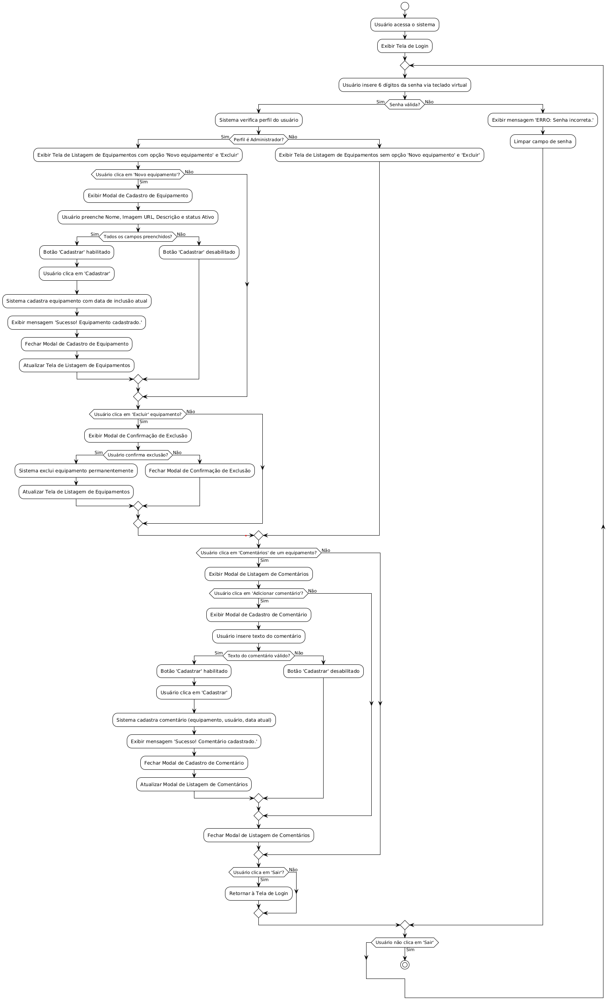
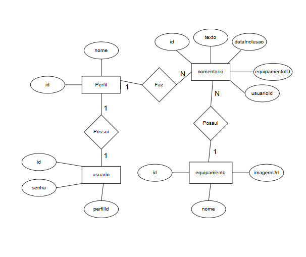

# Aula05 - Avaliação Prática - Techman

## Situação de Aprendizagem (Full Stack)- Manutenção de Equipamentos

||
|-|
|**Contextualização:**|
|Para facilitar o controle e gerenciamento do histórico de manutenções e demais registros de informações sobre determinado equipamento, as indústrias buscam constantemente soluções de software que tornem esse processo mais intuitivo, prático e dinâmico.|
|**Desafio:**|
|Para ajudar nesse problema, você deverá criar um sistema em sua plataforma de preferência que permita a gestão de equipamentos e de comentários sobre cada um dos equipamentos disponíveis na base de dados.<br>Nesse sistema, os usuários poderão inserir comentários de manutenção preventiva, manutenção corretiva, configurações e/ou qualquer outro compartilhamento de informação sobre o equipamento.<br>Além disso, você deverá manter um relatório/histórico de todos os equipamentos com seus respectivos comentários já inseridos no sistema.<br>O sistema desenvolvido deverá se chamar Techman e tem que conter uma área de login, recursos para cadastrar e excluir equipamentos (somente administrador) e recursos para exibição e inserção de comentários para cada equipamento.|

## Capturas de Tela
### Tela de Login
  

### Tela Principal 
 

### Comentarios
 


## Estrutura do Projeto
```
api/           - Backend Node.js/Express/Prisma
web/           - Frontend HTML/CSS/JS
```

## Como rodar o projeto
1. Instale as dependências em `api/`:
   ```bash
   cd api
   npm install
   ```
2. Configure o banco de dados em `.env` (MySQL).
3. Rode as migrações Prisma:
   ```bash
   npx prisma migrate dev
   ```
4. Inicie o backend:
   ```bash
   node server.js
   ```
5. Abra o `web/index.html` em seu navegador.

## Diagramas
### Diagrama de Atividade


### Diagrama Entidade-Relacionamento
